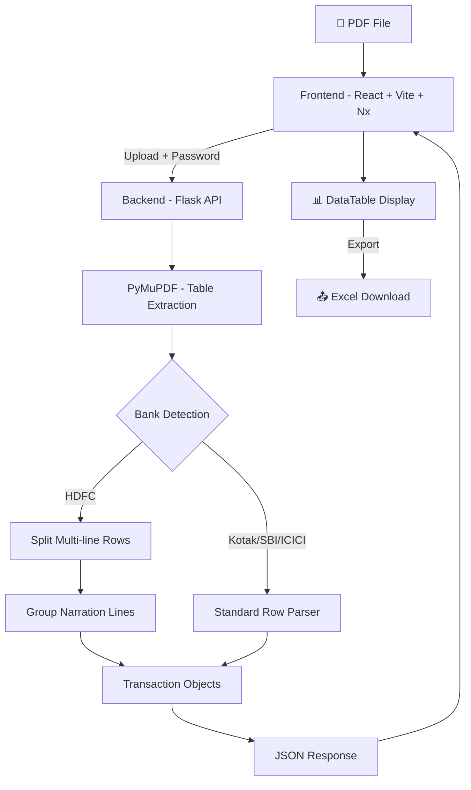
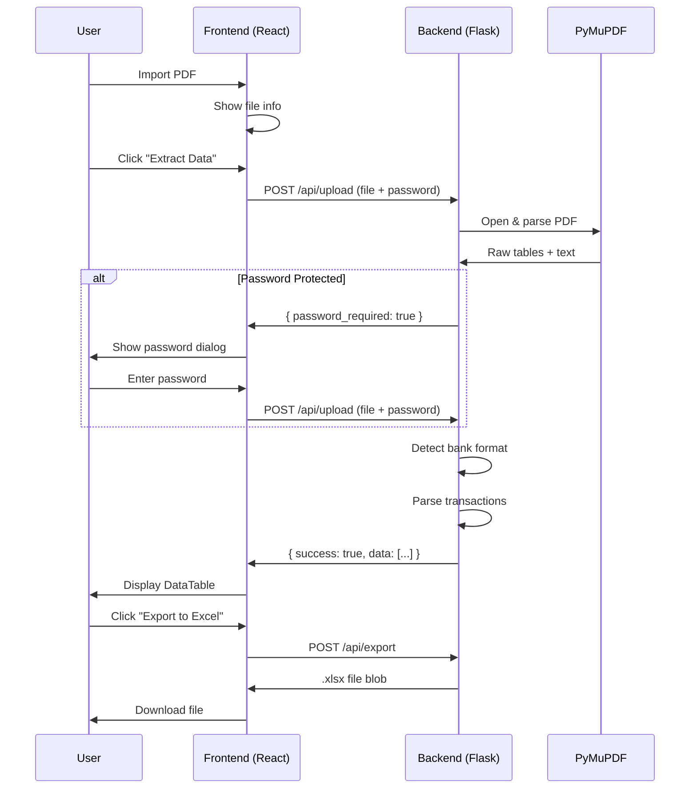

# 📄 PDF Extractor

A web application to extract transaction data from bank statement PDFs and export to Excel.

## Features

- **📥 Import PDF** — Upload bank statement PDFs (supports password-protected files)
- **👁️ Preview PDF** — View the uploaded PDF inline before extracting
- **📊 Extract Data** — Parse transactions into structured table format
- **📤 Export to Excel** — Download extracted data as `.xlsx` file
- **🌙 Dark Mode** — Toggle between light and dark themes

## Supported Banks

| Bank | Table Format | Status |
|------|-------------|--------|
| **HDFC Bank** | Merged rows (multi-line narration) | ✅ Supported |
| **Kotak Mahindra** | Standard row-per-transaction | ✅ Supported |
| **SBI** | Standard row-per-transaction | 🔧 Rules defined |
| **ICICI** | Standard row-per-transaction | 🔧 Rules defined |

> Bank-specific parsing rules are maintained in [`backend/bank_rules.py`](backend/bank_rules.py)

## Architecture



## Application Flow



## Project Structure

```
pdf-extractor/
├── backend/
│   ├── app.py              # Flask API server & parsing logic
│   ├── bank_rules.py       # Bank-specific parsing rules
│   └── requirements.txt    # Python dependencies
├── src/
│   ├── components/
│   │   ├── AppHeader.tsx    # Top bar with title & dark mode toggle
│   │   ├── ActionBar.tsx    # Import, Preview, Extract, Export buttons
│   │   ├── PdfPreview.tsx   # Inline PDF viewer
│   │   ├── TransactionTable.tsx # Paginated data table
│   │   ├── EmptyState.tsx   # "No PDF loaded" placeholder
│   │   └── PasswordDialog.tsx   # Password popup for protected PDFs
│   ├── App.tsx             # Main application orchestrator
│   ├── App.css             # Application styles
│   ├── theme.ts            # MUI theme configuration (light/dark)
│   ├── types.ts            # Shared TypeScript interfaces
│   ├── main.tsx            # React entry point
│   └── index.css           # Global styles & fonts
├── index.html              # HTML entry point
├── package.json            # Dependencies & Nx targets
├── tsconfig.json           # TypeScript configuration
├── vite.config.ts          # Vite build configuration
├── TEACH_ME.md             # Plain English guide to learn the project
├── PENDING_TASKS.md        # Upcoming features & tasks
└── README.md               # This file
```

## Getting Started

### Prerequisites

- **Node.js** (v18+) — [Download](https://nodejs.org/)
- **Python 3.12** — [Download](https://www.python.org/downloads/)

### Installation

1. **Install frontend dependencies:**
   ```bash
   npm install
   ```

2. **Install backend dependencies:**
   ```bash
   pip install -r backend/requirements.txt
   ```

### Running with Nx

All tasks are managed through **Nx**:

```bash
# Start the frontend dev server
npx nx dev

# Start the backend server
npx nx backend

# Build for production
npx nx build

# Preview production build
npx nx preview
```

Open **http://localhost:5173** in your browser.

### API Endpoints

| Method | Endpoint | Description |
|--------|----------|-------------|
| `POST` | `/api/upload` | Upload PDF & extract transactions |
| `POST` | `/api/export` | Export transactions to Excel |
| `POST` | `/api/debug` | Raw PDF table/text debug data |
| `GET`  | `/api/preview` | Serve decrypted PDF for preview |


## Tech Stack

| Layer | Technology |
|-------|-----------|
| Build System | Nx |
| Frontend | React 19, TypeScript, Vite, Material UI |
| Backend | Python 3.12, Flask |
| PDF Parsing | PyMuPDF (fitz) |
| Excel Export | openpyxl |
| HTTP Client | Axios |

## License

MIT
