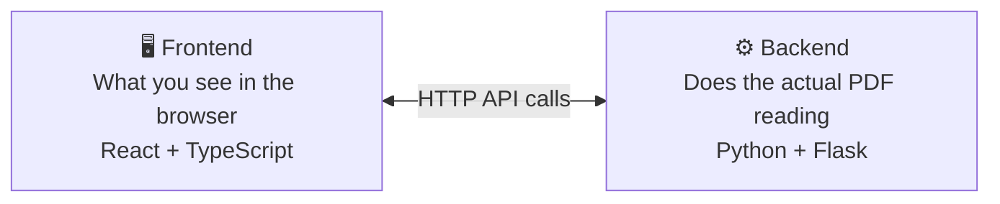
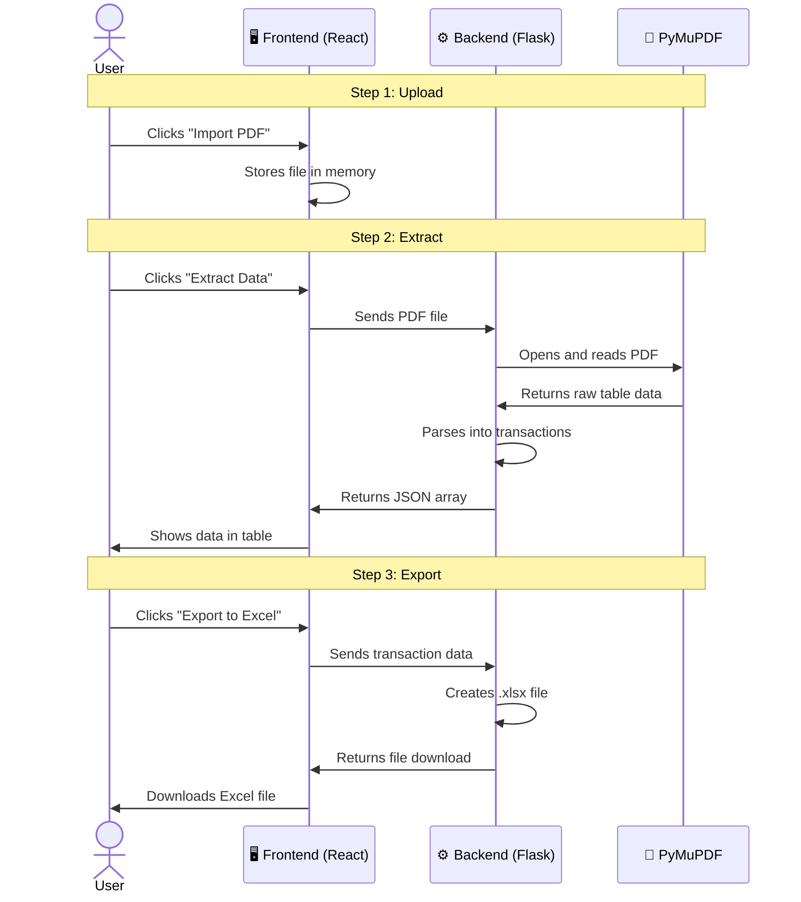

# 📚 Teach Me — PDF Extractor (Simple English Guide)

This document explains how the PDF Extractor works, step by step, in plain English. No jargon — just clear explanations with code examples.

---

## 🎯 What Does This App Do?

**In one sentence:** You upload a bank statement PDF, and the app reads it, pulls out all your transactions, and lets you download them as an Excel file.

```
Bank Statement PDF  →  App reads it  →  Table of transactions  →  Excel download
```

---

## 🏗️ How Is the Project Organized?

The app has **two parts** that talk to each other:



### Frontend (the website you see)
- Built with **React** (a library for building UIs)
- Written in **TypeScript** (JavaScript with type safety)
- Uses **Material UI** for pretty buttons, tables, etc.

### Backend (the engine behind the scenes)
- Built with **Python** and **Flask** (a simple web server)
- Uses **PyMuPDF** to read PDF files
- Uses **openpyxl** to create Excel files

---

## 📂 Project Files Explained

```
pdf-extractor/
│
├── src/                          ← Frontend code (TypeScript)
│   ├── main.tsx                  ← Starting point: loads the App
│   ├── App.tsx                   ← Brain: manages state, calls API
│   ├── App.css                   ← Visual styles (colors, layout)
│   ├── theme.ts                  ← Theme colors for light/dark mode
│   ├── types.ts                  ← Type definitions (what shape data has)
│   ├── index.css                 ← Global fonts and reset
│   └── components/               ← Reusable UI pieces
│       ├── AppHeader.tsx         ← Top bar with title + dark mode toggle
│       ├── ActionBar.tsx         ← Import, Preview, Extract, Export buttons
│       ├── PdfPreview.tsx        ← Shows the PDF in the browser
│       ├── TransactionTable.tsx  ← The data table with all transactions
│       ├── EmptyState.tsx        ← "No PDF loaded" message
│       └── PasswordDialog.tsx    ← Pop-up asking for PDF password
│
├── backend/                      ← Backend code (Python)
│   ├── app.py                    ← Flask server + PDF parsing logic
│   ├── bank_rules.py             ← Rules for each bank's format
│   └── requirements.txt          ← Python packages needed
│
├── index.html                    ← The one HTML file that loads everything
├── package.json                  ← Node.js dependencies
├── tsconfig.json                 ← TypeScript settings
└── vite.config.ts                ← Build tool settings
```

---

## 🔄 How Data Flows Through the App

### Step-by-step: From PDF to Excel



---

## 🧩 Frontend Explained (TypeScript / React)

### What is a Component?

A **component** is a reusable piece of UI. Think of it like a LEGO brick — you build the whole app by snapping components together.

```
App.tsx (brain)
├── AppHeader      ← "PDF Extractor" title bar
├── ActionBar      ← All the buttons
├── PdfPreview     ← Shows the PDF
├── TransactionTable ← Shows the data
├── EmptyState     ← "No PDF loaded" message
└── PasswordDialog ← Password pop-up
```

### How Components Talk to Each Other

Components talk using **props** (short for "properties"). The parent (`App.tsx`) passes data DOWN to children:

```typescript
// App.tsx passes data to ActionBar
<ActionBar
    file={file}              // The selected file
    extracting={extracting}  // Is extraction in progress?
    onExtract={handleExtract} // Function to call when button is clicked
/>
```

```typescript
// ActionBar receives and uses the data
interface ActionBarProps {
    file: File | null           // Can be a File or nothing
    extracting: boolean         // true or false
    onExtract: () => void       // A function with no return value
}

function ActionBar({ file, extracting, onExtract }: ActionBarProps) {
    return (
        <Button onClick={onExtract} disabled={!file || extracting}>
            {extracting ? 'Extracting...' : 'Extract Data'}
        </Button>
    )
}
```

### What is State?

**State** is data that can change over time. When state changes, React automatically re-renders the screen.

```typescript
// Declare state with useState
const [file, setFile] = useState<File | null>(null)
//     ^^^^  ^^^^^^^                          ^^^^
//     |     |                                |
//     |     Function to update it            Initial value (nothing)
//     The current value

// Later, when user picks a file:
setFile(selectedFile)  // React re-renders to show the file name
```

### What are Types?

Types tell TypeScript what **shape** your data has. This prevents bugs:

```typescript
// types.ts — defines what a Transaction looks like
interface Transaction {
    date: string      // "01/01/2026"
    details: string   // "IMPS-600114982784-Name..."
    cheque: string    // Reference number
    debit: string     // Money going out
    credit: string    // Money coming in
    balance: string   // Account balance after
}

// Now TypeScript will WARN you if you try:
transaction.dat  // ❌ Error: 'dat' doesn't exist, did you mean 'date'?
transaction.date // ✅ Works fine
```

### How API Calls Work

The frontend talks to the backend using **axios** (a library for HTTP requests):

```typescript
// Send PDF to backend
const formData = new FormData()
formData.append('file', file)     // Attach the PDF file
formData.append('password', '123') // Attach password if needed

const response = await axios.post('http://localhost:5000/api/upload', formData)
// response.data = { success: true, data: [...transactions], count: 12 }
```

---

## 🐍 Backend Explained (Python / Flask)

### What is Flask?

Flask is a simple Python web server. It listens for HTTP requests and responds:

```python
from flask import Flask, request, jsonify

app = Flask(__name__)

# When someone sends a POST request to /api/upload:
@app.route('/api/upload', methods=['POST'])
def upload():
    file = request.files['file']        # Get the uploaded file
    password = request.form.get('password', '')  # Get password if sent

    # ... process the PDF ...

    return jsonify({
        'success': True,
        'data': transactions,           # List of transaction dicts
        'count': len(transactions)
    })
```

### How PDF Parsing Works

PyMuPDF (called `fitz` in code) reads the PDF and finds tables:

```python
import fitz  # PyMuPDF

# Step 1: Open the PDF
doc = fitz.open(stream=pdf_bytes, filetype="pdf")

# Step 2: Loop through pages
for page_num in range(len(doc)):
    page = doc[page_num]

    # Step 3: Find tables on this page
    tabs = page.find_tables()

    for tab in tabs:
        # Step 4: Extract rows
        for row in tab.extract():
            # row = ['01/01/2026', 'IMPS-600114...', '', '5,000.00', '', '45,000.00']
            #        ^^^^^^^^^^^^   ^^^^^^^^^^^^^^^^      ^^^^^^^^^       ^^^^^^^^^^
            #        date           details               debit           balance
```

### The HDFC Problem (and how we solve it)

**Normal banks** put each transaction in its own row. Easy to parse.

**HDFC Bank** is different — they cram ALL transactions into ONE row, separated by newlines (`\n`):

```
Normal Bank (Kotak):                    HDFC Bank:
┌──────────┬──────────┬────────┐        ┌──────────┬──────────────────┬────────┐
│ Date     │ Details  │ Amount │        │ Date     │ Narration        │ Amount │
├──────────┼──────────┼────────┤        ├──────────┼──────────────────┼────────┤
│ 01/01    │ IMPS...  │ 5,000  │        │ 01/01    │ IMPS-600114...   │ 5,000  │
├──────────┼──────────┼────────┤        │ 03/01    │ ...Ref 600114    │ 3,000  │
│ 03/01    │ UPI...   │ 3,000  │        │          │ UPI-MOHANDASS... │ 1,000  │
├──────────┼──────────┼────────┤        │          │ ...Ref 600335    │        │
│ 04/01    │ POS...   │ 1,000  │        │          │ POS 435584...    │        │
└──────────┴──────────┴────────┘        │          │ ...Ref 600428    │        │
3 rows = 3 transactions                └──────────┴──────────────────┴────────┘
                                        1 row = 3 transactions! 😱
```

### How We Split HDFC Narrations

We look for **end markers** — patterns that signal the end of one transaction's description:

```python
def group_narration_lines(lines, num_groups):
    """
    Given: ['IMPS-600114...', 'Value Dt 01/01/2026 Ref 600114',
            'UPI-MOHANDASS...', 'Ref', '600335454148', ...]
    Returns: ['IMPS-600114... Value Dt 01/01/2026 Ref 600114',
              'UPI-MOHANDASS... Ref 600335454148', ...]
    """
    # Pattern 1: "Ref 600114982784" on the same line
    #   → This line is the END of a narration
    ref_same_line = re.compile(r'Ref\s+\d+')

    # Pattern 2: Line ends with "Ref", next line is just digits
    #   → The NEXT line is the end
    ref_end_of_line = re.compile(r'Ref\s*$')
    standalone_digits = re.compile(r'^\d{6,}$')

    # Pattern 3: "Value Dt 06/01/2026" without Ref
    #   → Some transactions (like ACH debits) don't have a Ref number
    value_dt_pattern = re.compile(r'Value\s+Dt\s+\d{2}/\d{2}/\d{4}')
```

### Bank Rules System

Each bank has its own class with detection and parsing rules:

```python
# bank_rules.py

class HDFCRules:
    """HDFC has merged rows — needs special narration grouping"""

    @staticmethod
    def detect(headers):
        # If table headers contain "NARRATION" → it's HDFC
        header_text = " ".join(str(h).upper() for h in headers)
        return "NARRATION" in header_text

class KotakRules:
    """Kotak has normal rows — each transaction = 1 row"""

    @staticmethod
    def detect(headers):
        header_text = " ".join(str(h).upper() for h in headers)
        return "CHEQUE" in header_text


# Auto-detect which bank:
def detect_bank(headers):
    for rules in [HDFCRules, KotakRules, SBIRules, ICICIRules]:
        if rules.detect(headers):
            return rules
    return None  # Unknown bank
```

---

## 🎨 Styling Explained

The app uses **two layers** of styling:

### 1. Material UI Theme (`theme.ts`)
Sets the overall look — colors, fonts, border radius:

```typescript
// Light mode colors
primary: { main: '#1565C0' }    // Blue buttons
secondary: { main: '#E65100' }  // Orange for "Extract"
success: { main: '#2E7D32' }    // Green for "Export"

// Dark mode colors
primary: { main: '#64B5F6' }    // Lighter blue
background: { default: '#121212' } // Dark background
```

### 2. CSS Classes (`App.css`)
Custom styles that override Material UI defaults:

```css
/* Red color for debit amounts */
.amount-debit {
    color: #D32F2F !important;
    font-weight: 600 !important;
}

/* Green color for credit amounts */
.amount-credit {
    color: #2E7D32 !important;
    font-weight: 600 !important;
}

/* Fade-in animation when content appears */
@keyframes fadeIn {
    from { opacity: 0; transform: translateY(8px); }
    to   { opacity: 1; transform: translateY(0); }
}
```

---

## 🔑 Key Concepts Summary

| Concept | What it means | Where it's used |
|---------|--------------|-----------------|
| **Component** | A reusable piece of UI (like a LEGO brick) | `AppHeader.tsx`, `ActionBar.tsx`, etc. |
| **Props** | Data passed from parent → child component | `<ActionBar file={file} />` |
| **State** | Data that changes over time (triggers re-render) | `useState<File | null>(null)` |
| **Interface** | Defines the shape of data (prevents bugs) | `Transaction`, `ActionBarProps` |
| **Flask Route** | A URL path the server responds to | `@app.route('/api/upload')` |
| **Regex** | Pattern matching for text (finds "Ref 12345") | `re.compile(r'Ref\s+\d+')` |
| **FormData** | Way to send files over HTTP | `formData.append('file', file)` |
| **Theme** | Color scheme + fonts for the whole app | `theme.ts` → light/dark mode |

---

## 🚀 How to Run

```bash
# Terminal 1: Start the backend
py -3.12 backend/app.py

# Terminal 2: Start the frontend
npm run dev

# Open http://localhost:5173 in your browser
```

---

## ❓ Common Questions

**Q: Why TypeScript instead of JavaScript?**
TypeScript catches bugs before you run the code. If you mistype `transaction.dat` instead of `transaction.date`, TypeScript tells you immediately.

**Q: Why separate components?**
Smaller files are easier to understand, test, and modify. Each file does ONE thing well.

**Q: Why Flask and not Node.js for the backend?**
PyMuPDF (the PDF parser) is a Python library. Python is great for data processing tasks like this.

**Q: Why does HDFC need special handling?**
Most banks put each transaction in its own table row. HDFC merges everything into one row with newline separators, which requires custom splitting logic.

**Q: What's `!important` in CSS?**
Material UI adds inline styles which normally override CSS. `!important` tells the browser: "This CSS rule wins, no matter what."
